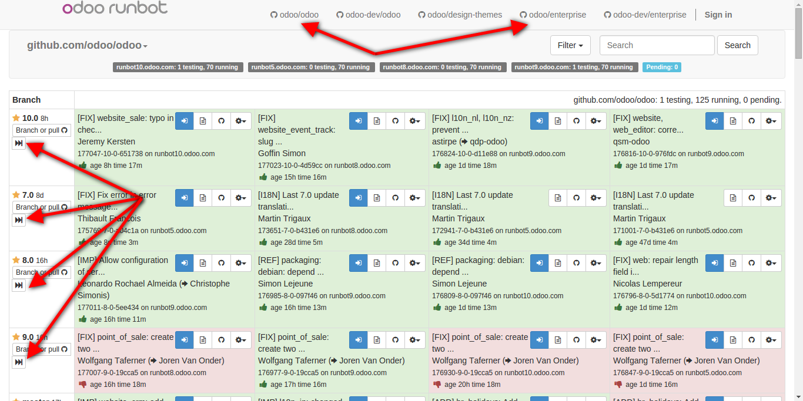
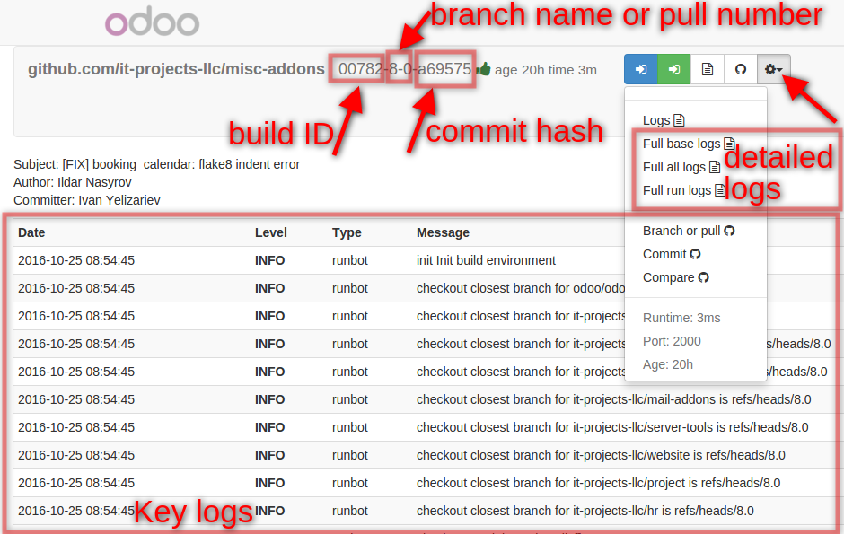

========
 Runbot
========

.. contents::
   :local:

runbot.odoo.com
===============

http://runbot.odoo.com/ -- official runbot. While its main purpose is checking pull requests to official repository, it is usefull on daily development routine.

* It allows to play with any odoo version. Each build has all modules installed with demo data.
* It allows to quickly try enterprise odoo versions

How to use runbot.odoo.com?
---------------------------

* open http://runbot.odoo.com/runbot/
* switch to repository you need. Odoo community (odoo/odoo) is default.
* find a row with odoo version you need (10.0, 9.0, 8.0, 7.0)
* click on *fast forward* icon to open latest build. Alternatively, click on any blue button on a row, that corresponds to odoo version you need.
* on login page enter credentials:

  * Admin

    * login: ``admin``
    * password: ``admin``

  * Demo

    * login: ``demo``
    * password: ``demo``

runbot.it-projects.info
=======================

http://runbot.it-projects.info/ -- customized runbot for IT-Projects` repositories.

Stages of making a build:

* Checkout sources from github
* **-base** database: install updated modules for pull request builds and base
  modules for branch builds. For some repositories explicit modules (i.e. ones,
  that are specified in runbot settings) are installed too
* **-all** database: install all modules of the repo
* run the build with two prepared databases

Main features:

* Blue button - enter to **-all** database
* Green button - enter to **-base** database
* Key logs (shown on build page) -- key logs, warnings and errors
* Detailed logs (txt files)

  * *Full base logs* -- full logs of installation process in **-base** database
  * *Full all logs* -- full logs of installation process in **-all** database
  * *Full run logs* -- full logs for both databases after running, i.e. when Blue
    and Green button are available. Logs includes cron work, url requests etc

How to deploy runbot?
=====================

There is docker that allows you deploy you own runbot for your repositores. Check it out for further information

* https://github.com/it-projects-llc/odoo-runbot-docker
