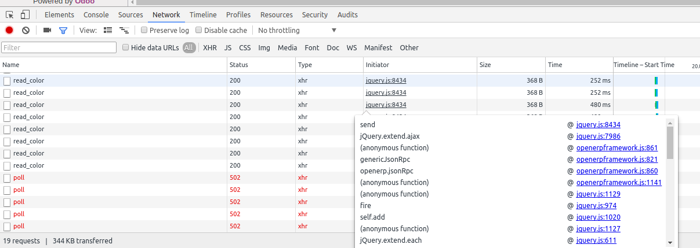

====================================
 Network tab at Browser's dev tools
====================================

Sometimes error are not printed neither in :doc:`Terminal <terminal-output>` nor in :doc:`Console <browser-console>`. Then you can try to find some usefull information  at Network tab of browser's developer tools.

Response value
==============
To see Response click on the request line and then navigate to Response tab.

Who made http request
=====================

Suppose we want to know which part of our script initiate the request.
To do that put mouse pointer above initiator column's element. 

.. note:: To see original odoo js files i.e. not minimized versions, open odoo in *debug mode (with assets)* first
