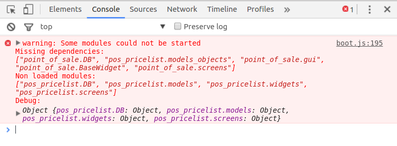
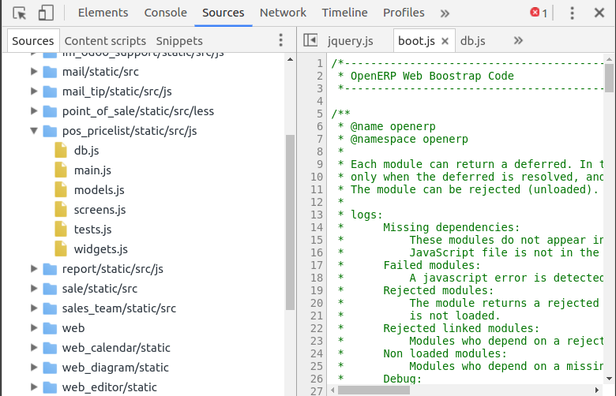

Error: Missing dependencies
===========================

For example, sometimes during page load displayed the error type:

``Missing dependencies: [...]
Non loaded modules: [...]``

You can find out reason in the Developer Tool in the tab Sources as described above.

Likely you can not find files included in the Missing dependencies list.
Then you need to check they are included in the view (.xml) files.

