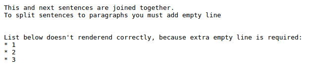
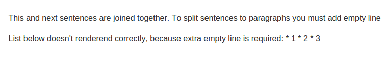

README.rst
==========

*README.rst* is the **first** file you have to create in new module, because *README.rst* helps you review requirements again before you start.

You can consider *README.rst* as a technical description of the module.

.. contents::
   :local:

Guidlines
---------

.. code-block:: rst

    ===========
    Module Name
    ===========

    Description or Technical specifications

    Usage
    =====

    * Open menu ...
    * Click ...

    Credits
    =======

    Contributors
    ------------
    * Developer name <PERSON@it-projects.info>

    Sponsors
    --------
    * `IT-Projects LLC <https://it-projects.info>`_

    Further information
    ===================

    HTML Description: https://apps.odoo.com/apps/modules/VERSION/TECHNICAL_NAME/

    Tested on Odoo 8.0 ODOO_COMMIT_SHA_TO_BE_UPDATED

Rendering
^^^^^^^^^

    Be sure, that rendered README file looks as you expected.

Raw:

Rendered:

OCA's README
^^^^^^^^^^^^

* https://raw.githubusercontent.com/OCA/maintainer-tools/master/template/module/README.rst

Usage
-----

Instruction how to check that module works. What shall user do and what would he get. 

HTML Description
----------------

Link to app store, e.g.

.. code-block:: rst

    HTML Description: https://apps.odoo.com/apps/modules/9.0/web_debranding/

Tested on
---------

.. code-block:: rst

    Tested on Odoo 8.0 a40d48378d22309e53e6d38000d543de1d2f7a78

commit sha can be found as following

.. code-block:: shell

    cd /path/to/odoo
    git rev-parse HEAD

