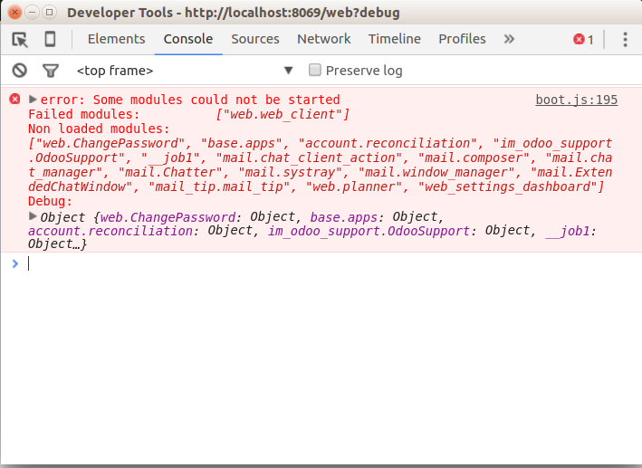
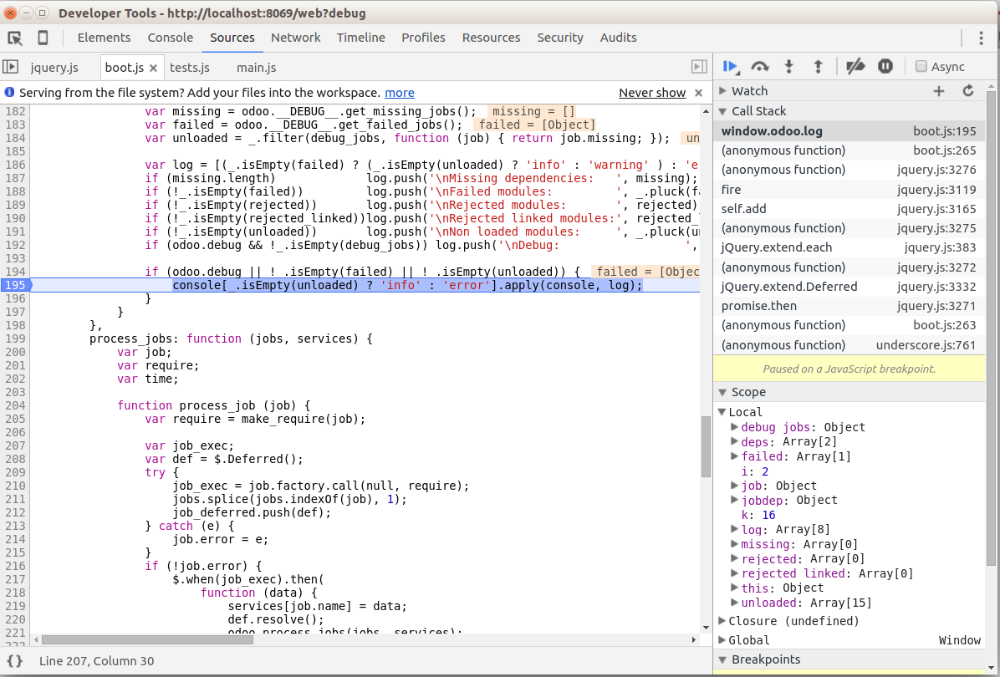
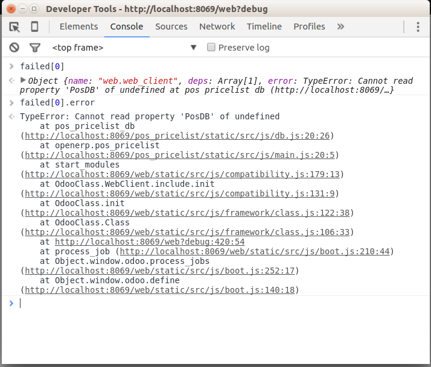

Error: Failed modules
=====================

If into server console no errors but boot.js raise exception that find out reason error next steps:

1. Go to error line into boot.js.

2. Turn on breakpoint.

3. Rerun script.

4. When script stop on error line move to console.

5. Typing command: failed[0].error

6. To receive the output

