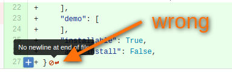

==================================
 __manifest__.py (__openerp__.py)
==================================

.. contents::
   :local:

Filename
========
* Use ``__openerp__.py`` for odoo 9.0 and earler versions.
* Use ``__manifest__.py`` for odoo 10.0 and later versions, but don't rename filename on porting module from one version to another

Template
========

Use example below as template. What are important here:

* order of attributes 
* not used attributes are represented
* quote characters (``"``, ``"""``)
* empty lines
* no description attribute
* price and currency attributes are commented-out if not used
* comma after last item in list (e.g. in 'depends' attribute)
* add new line symbol at the end of file (i.e. right after last ``}``)

.. literalinclude:: templates/__manifest__.py

See also:

* OCA's template: https://github.com/OCA/maintainer-tools/blob/master/template/module/__openerp__.py

name
====

It must be non-technical name of the module

summary
=======

Short description of the module. E.g. you can describe here which problem is solved by the module. It could sound as a slogan.

category
========

Categories from the list below are preferred.

   * ``Accounting``
   * ``Discuss``
   * ``Document Management``
   * ``eCommerce``
   * ``Human Resources``
   * ``Industries``
   * ``Localization``
   * ``Manufacturing``
   * ``Marketing``
   * ``Point of Sale``
   * ``Productivity``
   * ``Project``
   * ``Purchases``
   * ``Sales``
   * ``Warehouse``
   * ``Website``
   * ``Extra Tools``

Hidden
------

For technical modules ``Hidden`` category can be used::

    "category": "Hidden",

Such modules are excluded from search results on app store.

version
=======

*Note: whenever you change version, you have to add a record in* :doc:`changelog.rst <changelog.rst>`

The version number in the module manifest should be the Odoo major
version (e.g. `8.0`) followed by the module `x.y.z` version numbers.
For example: `8.0.1.0.0` is expected for the first release of an 8.0
module.

The `x.y.z` version numbers follow the semantics `breaking.feature.fix`:

  * `x` increments when the data model or the views had significant
    changes. Data migration might be needed, or depending modules might
    be affected.
  * `y` increments when non-breaking new features are added. A module
    upgrade will probably be needed.
  * `z` increments when bugfixes were made. Usually a server restart
    is needed for the fixes to be made available.

If applicable, breaking changes are expected to include instructions
or scripts to perform migration on current installations.

If a module ported to different odoo versions (e.g. 8 and 9) and some update is
added only to one version (e.g. 9), then version is changed as in example below:

* init

  * 8.0.1.0.0
  * 9.0.1.0.0
* feature added to 8.0 and ported to 9.0

  * 8.0.1.1.0
  * 9.0.1.1.0
* feature added to 9.0 only and not going to be ported to 8.0:

  * 8.0.1.1.0
  * 9.0.1.2.0
* fix made in 9.0 only and not going to be ported to 8.0:

  * 8.0.1.1.0
  * 9.0.1.2.1
* fix made in 8.0 and ported to 9.0

  * 8.0.1.2.2
  * 9.0.1.2.2

i.e. two module branches cannot have same versions with a different meaning

author
======

Use company first and then developer(s): ::

        "author": "IT-Projects LLC, Developer Name",

In the main, if module already exists and you make small updates\fixes, you should not add your name to authors.

author in OCA
-------------

For OCA's repositories put company name first, then OCA. Developers are listed in README file: ::

    "author": "IT-Projects LLC, Odoo Community Association (OCA)",

website
=======

Url to personal page at company's website (e.g. ``"https://it-projects.info/team/yelizariev"``)

license
=======

IT-Projects LLC uses following licences:

* ``"GPL-3"`` for odoo 8.0 and below
* ``"LGPL-3"`` for odoo 9.0 and above

For OCA's repositories use ``"AGPL-3"``.

external_dependencies
=====================

Check if some python library exists::

  "external_dependencies": {"python" : ["openid"]}

Check if some sytem application exists::

  "external_dependencies": {"bin" : ["libreoffice"]}

See also: :doc:`External dependencies in odoo<../py/external-imports>`

