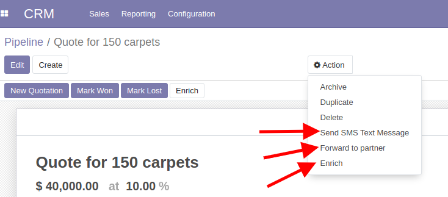

==============
 Actions Menu
==============

To add such button, you need to create ``ir.actions.act_window`` record with ``binding_model_id`` value.

14.0+
=====

`Example for Odoo 14.0+ <https://github.com/odoo/odoo/blob/45c9dc8e389908d32be076b3b49597a9dd305b5b/addons/crm_sms/views/crm_lead_views.xml#L17-L28>`__:

.. code-block:: xml

    <record id="crm_lead_act_window_sms_composer_multi" model="ir.actions.act_window">
        <field name="name">Send SMS Text Message</field>
        <field name="res_model">sms.composer</field>
        <field name="view_mode">form</field>
        <field name="target">new</field>
        <field name="context">{
            'default_composition_mode': 'comment',
            'default_res_id': active_id,
        }</field>
        <field name="binding_model_id" ref="model_crm_lead"/>
        <field name="binding_view_types">form</field>
    </record>

See also https://www.odoo.com/documentation/master/howtos/backend.html#launching-wizards

13.0
====

`Example for Odoo 13.0 <https://github.com/odoo/odoo/blob/2a7ec79c6a4563b608a4525ebccdea5978799caa/addons/crm_sms/views/crm_lead_views.xml#L17-L28>`__:

.. code-block:: xml

    <act_window id="crm_lead_act_window_sms_composer_multi"
        name="Send SMS Text Message"
        binding_model="crm.lead"
        res_model="sms.composer"
        binding_views="form"
        view_mode="form"
        target="new"
        context="{
            'default_composition_mode': 'comment',
            'default_res_id': active_id,
        }"
    />

See also https://www.odoo.com/documentation/13.0/howtos/backend.html#launching-wizards

12.0-
=====

`Example for Odoo 12.0- <https://github.com/odoo/odoo/blob/6c53f1a09d0969379d59d361158c48a31a841b76/addons/point_of_sale/views/pos_config_view.xml#L504-L509>`__:

* there is no ``binding_views`` option
* ``src_model`` is the same as ``binding_model``

.. code-block:: xml

    <act_window
        id="act_pos_config_sessions"
        name="Sessions"
        src_model="pos.config"
        res_model="pos.session"
        domain="[('config_id', '=', active_id)]" />

See also https://www.odoo.com/documentation/12.0/howtos/backend.html#launching-wizards
