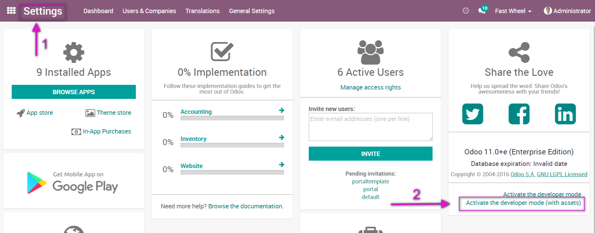
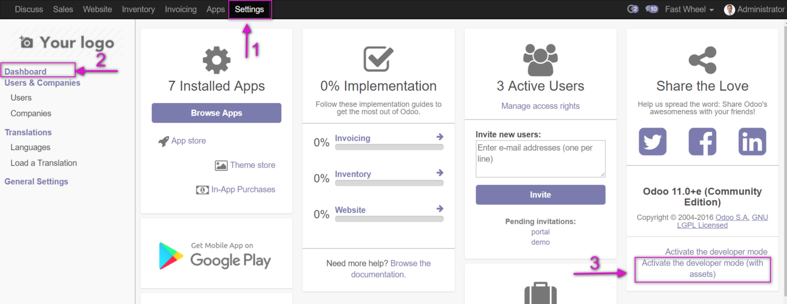

===================================
 How to activate debug assets mode 
===================================

1.  Add ``debug=assets`` parameter to your url, e.g.: ::

     localhost:8069/web?debug=assets#
     
2. Use UI

10.0+
~~~~  
 
* go to ``Settings``

* click ``Activate the developer mode(with assets)``

