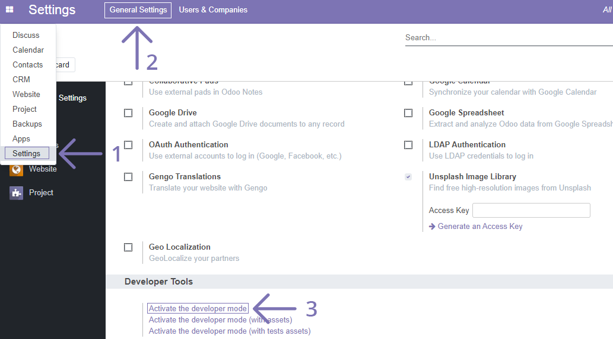
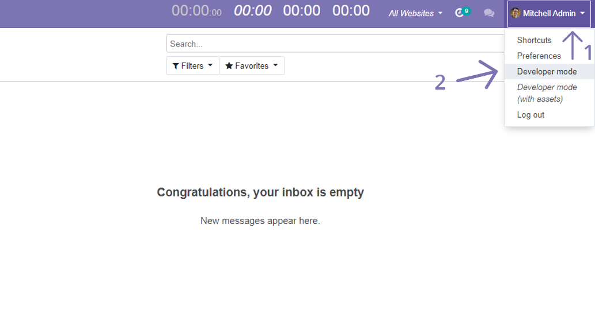
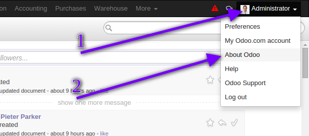
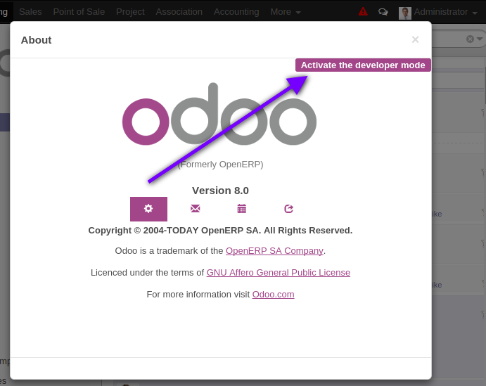

================================
 How to activate developer mode

================================

Add ``debug`` parameter to your url, for example::

     localhost:8069/web?debug=1

or use UI as described below

12.0+
=====

* Open menu ``[[ Settings ]] >> [[ General Settings ]] >> Developer Tools``

* click ``[Activate the developer mode]``

12.0+ with the `web_debranding <https://www.odoo.com/apps/modules/12.0/web_debranding/>`
==============================

* go to the User menu on the upper right corner

* click ``[Developer mode]``

10.0+

=====

* go to ``[[ Settings ]] ``

* click ``[Activate the developer mode]``

.. image:: ../../images/debug-3.png

10.0+ with the `web_debranding <https://www.odoo.com/apps/modules/10.0/web_debranding/>`
==============================

* go to the User menu on the upper right corner

* click ``[Developer mode]``

.. image:: ../../images/debug-4.png

9.0, 8.0

========

* click button at top right-hand corner ``<User Name> -> About Odoo``

* click ``[Activate the developer mode]``

* In odoo 8.0 you may need to :doc:`Enable technical features<technical-features>` too
