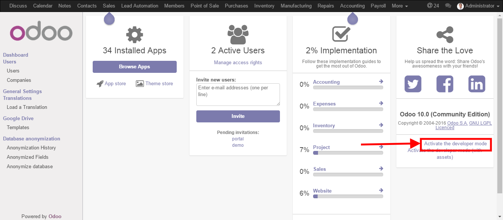
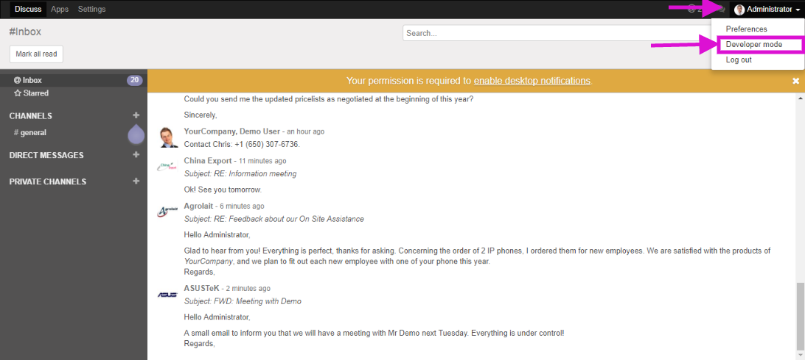

================================
 How to activate developer mode
================================

1.  Add ``debug`` parameter to your url, e.g.: ::

     localhost:8069/web?debug=1

2. Or use UI

9.0
===

* click button at top right-hand corner ``<User Name> -> About Odoo``

  .. figure:: ../../images/debug-1.png

* click ``Activate the developer mode``

  .. image:: ../../images/debug-2.png

10.0+
=====

* go to ``Settings``

* click ``Activate the developer mode``

`web_debranding <https://www.odoo.com/apps/modules/10.0/web_debranding/>`_ module 
===============
* go to the User menu on the upper right corner

* click ``Developer mode``

