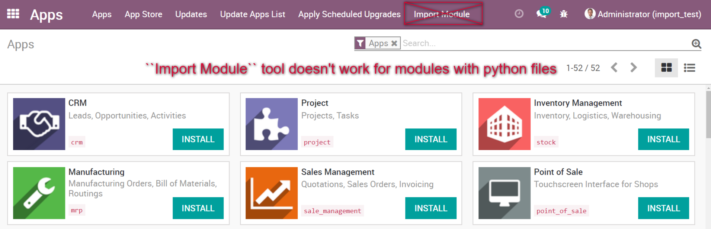

==============================
 How to install/update module
==============================

.. contents::
   :local:

.. warning:: ``Import Module`` tool (import from a zip  file) doesn't work for modules with python files. It means that it doesn't work in most cases

.. image:: ../../images/import-11-1.png

From zip archive
================

* unzip module to your addons folder
* restart odoo server

11.0+
-----

install
~~~~~~~

* :doc:`activate developer mode <debug-mode>`
* navigate to ``Apps`` menu
* click ``Update Apps List`` 
* search and open a module you need
* click ``[Install]``

update
~~~~~~

* :doc:`activate developer mode <debug-mode>`
* navigate to ``Apps`` menu
* search and open a module you need
* click ``Upgrade``

10.0+
-----

install
~~~~~~~

* :doc:`activate developer mode <debug-mode>`
* navigate to ``Apps`` menu
* click ``Update Apps List``
* search and open a module you need
* click ``[Install]``

update
~~~~~~

* :doc:`activate developer mode <debug-mode>`
* navigate to ``Apps`` menu
* search and open a module you need
* click ``Upgrade``

9.0
---
install
~~~~~~~

* :doc:`activate developer mode <debug-mode>`
* navigate to ``Apps`` menu
* click ``Update Apps List``
* search and open a module you need
* click ``[Install]``

update
~~~~~~

* :doc:`activate developer mode <debug-mode>`
* navigate to ``Apps`` menu
* search and open a module you need
* click ``Upgrade``

8.0
---

install
~~~~~~~

* navigate to ``[[ Settings ]] >> Local Modules``
* search and open a module you need
* click ``[Install]``

update
~~~~~~

* navigate to ``[[ Settings ]] >> Local Modules``
* search and open a module you need
* click ``Upgrade``
