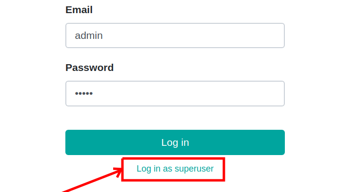

==============================
 How to log in as a superuser
==============================

12.0+
-----

* open page with login form, for example::

     localhost:8069/web/login

* add ``debug`` parameter to your url, for example::

     localhost:8069/web/login?debug=1

* enter the username and password of a user which is in ``Administration: Settings`` (``base.group_system``) security group, for example::

     Username: admin
     Password: admin

* click to ``Log in as superuser`` link below the ``Log in`` button

