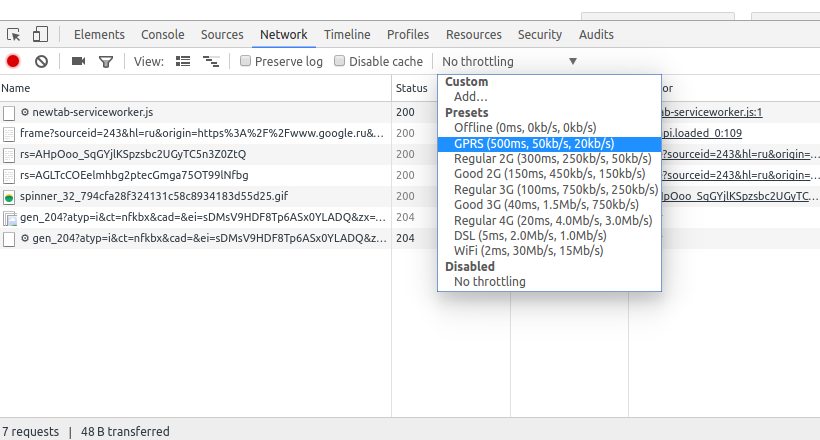

===================================================
 Emulation of slow internet connections in browser
===================================================

Emulation of package lossing
============================

In case if you need to emulate *bad* connection, i.e. it works and probably fast, but lose some percents of TCP packages, then do as following

.. code-block:: sh

    # check your network interfaces
    ifconfig
    
    # Example below is for eth0
    # Other possbile values are
    # * wlan0 - wireless connection
    # * lo - local connection. Use this, if your run a server on your machine
    
    # lose 30 %
    sudo tc qdisc add dev eth0 root netem loss 30%
    
    # "burst of losing"
    # Probabilyt of each next lossing depends on previous result.
    # For example below:
    # Pnext = 0.1 * Pprev + (1-0.1)* Random(0,1)
    # Then the package is lost, if Pnext < 0.3
    sudo tc qdisc add dev eth0 root netem loss 30% 10%
    
    # show current settings
    tc -s qdisc show dev eth0
    
    # reset settings
    sudo tc qdisc del dev eth0 root
